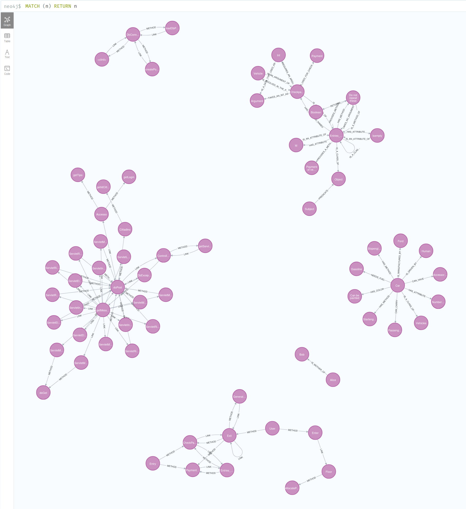

# NL2CodeTrace: Code Understanding and Traceability with LlamaIndex & Graph Databases
==================================================================================

## Overview
--------
NL2CodeTrace is a code understanding, retrieval, and traceability system that integrates machine learning, knowledge graphs, 
and vector embeddings to analyze software codebases. It extracts relationships between software components 
(e.g., classes, methods, function calls) and allows for querying, reasoning, and traceability analysis using 
LLMs (Large Language Models) and structured retrieval techniques.

This project leverages:
- LlamaIndex for indexing, retrieval, and querying of code and documentation.
- Neo4j / Kuzu as graph stores for knowledge representation.
- ChromaDB as a vector store for efficient similarity search.
- Transformers-based LLMs (e.g., Mistral, Llama2, DeepSeek, Gemma) for natural language-based queries and code generation.

## Key Features
------------
- Code Graph Generation: Converts source code into graph representations, capturing method calls, class dependencies, and relationships.
- Multi-Modal Retrieval: Supports vector-based, keyword-based, and graph-based retrieval.
- Traceability Links: Automatically links requirements to code elements, helping with software maintenance and compliance tracking.
- Question Answering & Querying: Allows natural language queries over the indexed codebase.
- Multi-Threaded Processing: Efficiently processes large codebases using parallel execution.
- Fine-tuned Models for Code Understanding: Leverages custom fine-tuned models for semantic search and traceability analysis.
- Evaluation Pipeline: Provides automated evaluation of retrieval correctness and traceability results.
- Neo4j APOC Plugin Support: Uses APOC 4.4.0.35 for Neo4j 4.4.40 to enhance graph operations.

## Installation & Setup
---------------------
1. Clone the Repository
   ```
   git clone <repository-url>
   cd nl2codetrace
   ```

2. Install Dependencies
   Ensure you have Python 3.8+ installed, then run:
   ```
   pip install -r requirements.txt
   ```
3. Set Up Neo4j with APOC Plugin
   Install Neo4j 4.4.40
   - Download from Neo4j Download
   - Install and start the Neo4j service.
   ```
   sudo apt install neo4j
   sudo start neo4j  - To start the service
   sudo stop neo4j   - To stop the service
   sudo systemctl restart neo4j - To restart the service
   sudo neo4j status - To check the status of the service
   ```

   Install APOC Plugin (Version 4.4.0.35)
   - Download apoc-4.4.0.35-core.jar from: APOC Releases
   - Move the file to the Neo4j plugins directory:
     sudo mv apoc-4.4.0.35-core.jar /var/lib/neo4j/plugins/
   - Modify the Neo4j configuration file (/etc/neo4j/neo4j.conf):
     sudo nano /etc/neo4j/neo4j.conf
     Add or update the following lines:
     ```
     dbms.security.procedures.unrestricted=apoc.*
     dbms.security.procedures.allowlist=apoc.*
     apoc.meta.enabled=true
     dbms.memory.transaction.global_max_size=512M
     ```
   - Restart Neo4j:
   ```
     sudo systemctl restart neo4j
   ```
   Verify APOC Installation
   - Open Neo4j Browser ```(http://localhost:7474).```
   - Run the following command:
   ```
     CALL apoc.meta.data();
   ```
   - If successful, APOC is installed and ready to use.

4. Set Up HuggingFace API Token (For LLMs)
   ```
   export HUGGINGFACE_TOKEN=<your_huggingface_api_key>
   ```

5. Configure Environment Variables
   ```
   Create a .env file and set the required API keys:
   NEO4J_USERNAME=neo4j
   NEO4J_PASSWORD=yourpassword
   NEO4J_URL=bolt://localhost:7687
   HUGGINGFACE_TOKEN=your_huggingface_api_key
   ```

Project Structure
-----------------
<pre>

nl2codetrace 

├── indexing           # Code indexing and vector storage

├── querying           # Querying logic for different retrieval types

├── evaluation         # Evaluation scripts for traceability accuracy

├── prompts            # Custom templates for LLM queries

├── api_models         # LLM & embedding model configuration

├── code2graph         # Code graph extraction and method linking

├── constants          # Global constants used across modules

├── data_repos         # Sample datasets for testing and evaluation

├── results            # Stores retrieval results and traceability links

├── config.py          # Configuration settings (DB, API keys)

├── main.py            # Main execution script

├── requirements.txt   # Dependencies

└── README.md          # Project documentation

All results and traceability outputs will be stored in the 'results/' folder.
</pre>
---------------------------------------------------

# Code Strusture Visualisations
Present in the **CodeStrusture-Visualisations** Folder


## Issues to be Resolved

### Issue: LLM Prompt Repetition

#### Problem Description
The LLM sometimes redundantly repeats the prompt within its responses, leading to outputs that are too verbose and challenging to parse. This behavior results in responses that are not only large but also less effective in delivering concise information.

#### Measures Taken
- **Prompt Template Refinement**: We have updated the `llama-index-core/llama-index/core/prompts/default-prompts.py` with new templates that explicitly instruct the model not to repeat the question part of the prompt. This aims to guide the model towards generating more concise and relevant responses.

- **Model Upgrade Consideration**: There is an ongoing consideration to switch to a larger model with more than 7 billion parameters. Larger models are generally better at understanding context and adhering to nuanced instructions, which might reduce the tendency to repeat prompts.

- **Example of Expected Response**: For reference, a screenshot of the response from OpenAI's ChatGPT, which handles similar prompts effectively, has been included in the project documentation to illustrate the expected response format and conciseness.

 


We leverage regular expressions (regex) to efficiently parse and extract specific data from structured text files. The following regex patterns are crucial for our data extraction tasks:

#### 1. File Identification
To identify and extract filenames within the dataset, we use the following regular expression:
```regex
r"'?(EA\\d+\\.txt)"
```

#### 2. Find Class Names
To identify and extract classnames for each requirement files, we use the following regular expression:
```regex
r"<<ANSWER>>.*?\\[([^\\]]+)\\]"
```

## Neo4j Storage




# Note

**Issue with Solution Links in eANCI dataset**

The solution links in the eANCI dataset reference ```.java``` file names instead of class names. As a resul, this mismatch has led to a decline in the evaluation metrics. Future improvements could involve mapping files names to their corresponding class names to enhance accuracy
